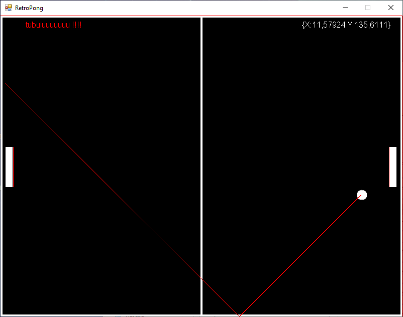

# high-speed-pong
I started a small pong project for fun and I ended up coding a high speed collision system...

With a simple system (translation with speed vector) the ball can easily pass through the bars at high speed, so I calculated ball's next position depending on its speed, direction and  the objects on its path. no the ball can have a huge speed.

And then I had fun with a line collision system.